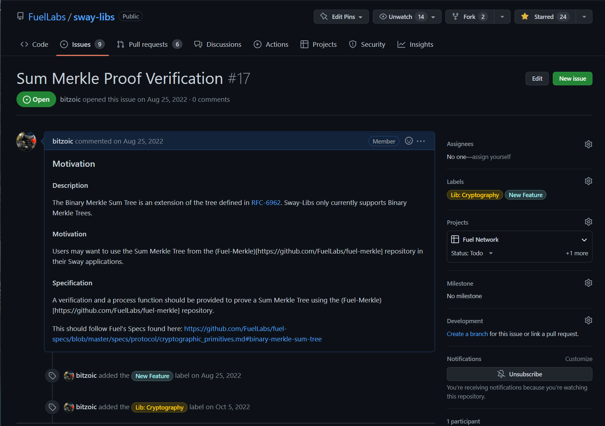

# Issue summary

You can see the activity of an issue by looking at the number of comments. This doesn't really tell you much aside from that there is a discussion about what should be done.

Clicking on the issue near the bottom `Sum Merkle Proof Verification` we can see some information about the library with some information on what the library intends to implement and why it is needed.

